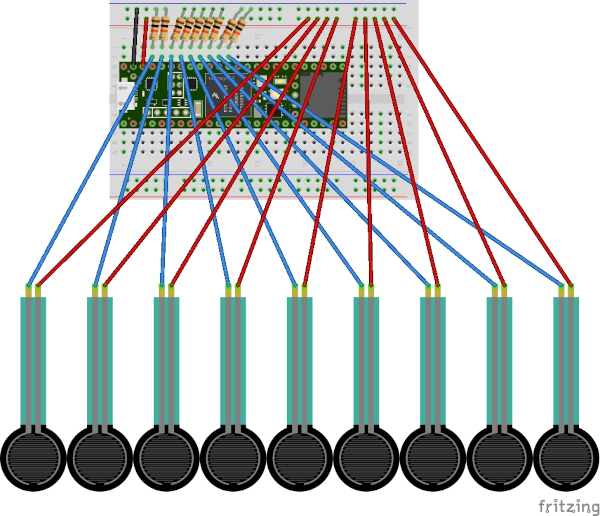
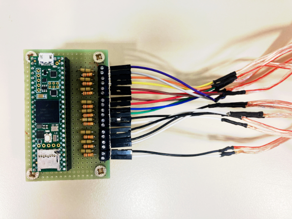
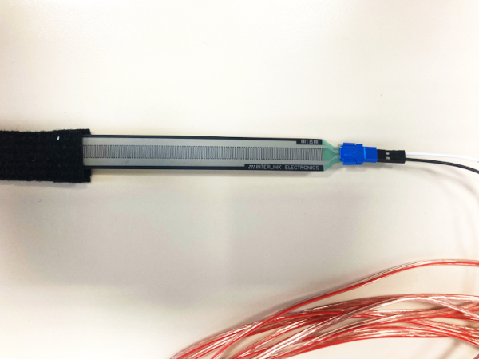
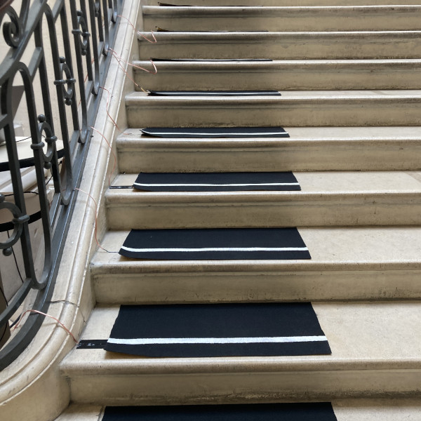

# MIDI Stairs Controller

### A simple 9 pressure sensitive keys controller to be installed on 9 stair steps

The `MIDIStairsController` Arduino sketch is designed to be uploaded to a Teensy 4.1 board.  
It takes 9 analog inputs from FSR ribbon sensors, smoothes them a little and detects press and release events on each FSR.  
It uses a two-threshold + velocity based algorithm that is able to detect the pressing velocity reliably.  
On press event detection it sends a MIDI `NOTE ON` message with the corresponding velocity.  
On release event detection it sends a MIDI `NOTE OFF` message.  
Each sensor is bound to a specific MIDI note (1 for input A1, 2 for input A2, etc).  
The 9 FSR sensors should be wired to analog inputs A1 to A9 (pins 15 to 23, see [teensy 4.1 official page](https://www.pjrc.com/store/teensy41.html)), following this schema :  

We made this prototype board for the event :  

We soldered jumper wire ends to both extremities of 2 meters long copper speaker cables to connect the FSR sensors to the board's screw terminals.  
We used [these FSR sensors](https://www.lextronic.fr/capteur-de-force-fsr4-1202.html) on which we mounted [these adapters](https://www.lextronic.fr/connecteur-femelle-2-plots-pour-fsr-31549.html) for ease of use, robustness and transportability :

We cut black carpet pieces and painted white stripes on them to visualize the sensors that we installed underneath.  
Once setup, the interactive stairs looked like this :  

