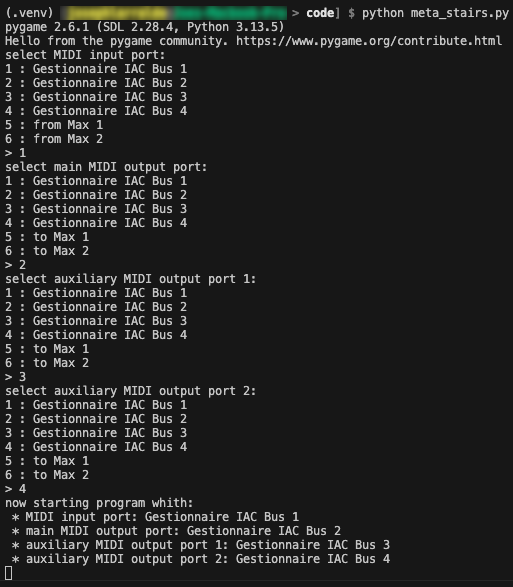
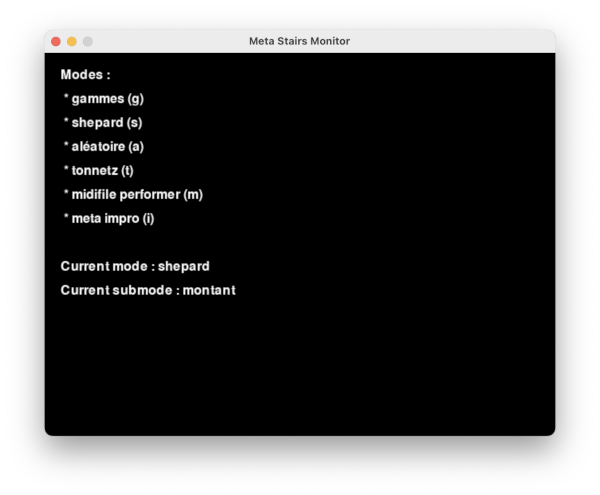

# MetaStairs engine

A multi-mode MIDI note events processor for the MetaStairs project

## installation

NB : you might need to replace `python` with `python3` in the below commands as this is a python 3 program.

* `cd` into this folder
* create `venv` : `python -m venv .venv`
* activate `venv` : `source .venv/bin/activate` on mac
* install requirements : `python -m pip install -r requirements.txt`
* start script : `python meta_stairs.py`

## usage

When the script starts, it will prompt you to select various MIDI inputs and outputs.  
On mac, we used several IAC busses (you create more than the default one from the *Audio and MIDI configuration* app).  
* If the `MIDI Stairs Controller` is connected via USB, you should select it as the `MIDI input port`, or you can select another device for testing like a regular MIDI keyboard controller.  
* For the `main MIDI output port`, select e.g IAC Bus 2 on Mac (this is the port we used as input in reaper, but you can adapt the settings if you use a different OS). The `main MIDI output port` is used by the internal modes (all modes except `midifile performer` and `meta impro`).  
Read on for more information on modes.  
* The selected `auxiliary MIDI output ports 1 and 2` should also be used as MIDI input ports by the `midifile performer` and `meta impro` external processes, respectively. These processes should then send their MIDI messages to the same port as the selected main MIDI output port (or whatever other port reaper is listening to) so that they can be played by the reaper project.  

Once the MIDI inputs and outputs have been selected, a window opens and allows to switch between different modes :

Each mode can be selected by a letter shortcut and one can navigate through its submodes using the arrow keys :

* gammes (g) : with this mode each step has a fixed note assigned, it's similar to a regular keyboard but submodes define various scales :
    * diatonique (all steps are white piano keys)
    * chromatique (consecutive steps are spaced by a semitone)
    * gamme par ton (consecutive steps are spaced by a full tone)
* shepard (s) : each step is a shepard note and depending on the submode :
    * montant : on each new step, the next shepard note is the next upper semitone
    * descendant : on each new step, the next shepard note is the next lower semitone
* aléatoire (a) : no submode, on each new step a random note from the 88 key piano ambitus is played (this one is trivial and we didn't really use it)
* tonnetz (t) : no submode, every NOTE ON events a new scale is generated from a triad obtained via random tonnetz navigation and spread across all the piano octaves. Each step randomly plays a note from a subset of all possible notes, depending on its position (lower steps play lower notes and higher step play heigher notes). With 9 steps, each step usually has a choice of 2 notes, whatever triad is active.
* midifile performer (m) : this mode is delegated to an external process, see below
* meta impro (i) : this mode is also delegated to an external process, see below

Modes are responsible for defining the MIDI channels on which they sends their messages (they are actually all hardcoded in `modes/orchestrator.py`), which will target specific virtual instruments in the reaper project. For instance, all modes will send messages on channel 1 by default and will be played by a virtual piano, except modes shepard (channel 2, played by a marimba), tonnetz (channel 3, played by a celesta), and the meta impro program (channel 4, played by a rhodes-like electric piano).

The `midifile performer` mode is operated by a web app that can be accessed [here](https://scrime-apps.labri.fr/web-midifile-performer-dev). It should be run on Chrome for MIDI support. You can also [clone](https://github.com/scrime-u-bordeaux/web-midifile-performer) it and use the `develop` branch locally. For the moment the app is not able to remap the original MIDI channels from the loaded files to user defined ones, but we used piano scores encoded with messages on channel 1 (in our case, this targeted the virtual piano in reaper so it was ok).

The `meta impro` mode is operated by an experimental variant of the `midifile performer` web app that provides several improvisation modes. It is a python program that should be executed locally. A specific branch (`nuit-des-escaliers`) was created for this project and the code is available [here](https://github.com/scrime-u-bordeaux/metaImpro). The MIDI channel is hardcoded so you have to modify it from the source if you want to change it.